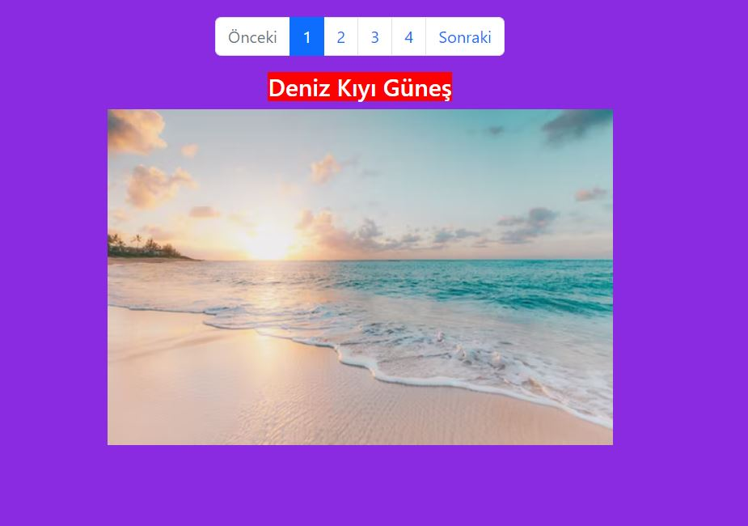
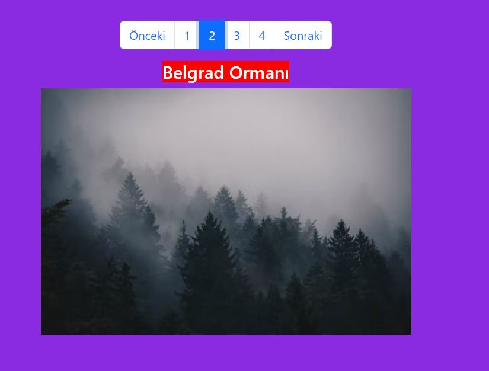

# Angular-Directives-Ornek-Proje
Angular Directives Ornek Proje
#
- Proje, Angular Directives konusunun öğreniminde örnek olması için yapıldı.

- Proje, girilen index değerine göre ekrana bölge ismi ve resminin gelmesini temel alıyor.
- Kullanılan Pagination yapısı Bootstrap kütüphanesinden alındı.
- Pagination'a o anki sayfa numarasına göre 'Önceki' ve 'Sonraki' butonlarını devre dışı bırakma özelliği verildi.
- Buna göre ilk sayfada 'Önceki', son sayfada da 'Sonraki' butonu devremdışı kalıyor.
- Onlarca sayfa olma durumunda da Pagination'da sağdan ve soldan 4'er sayfa sayısı görünmesi eklendi.
- Oluşturulan Custom Directive sayesinde, bölge adınının arka planına HTML sayfasından müdahale edilebilmesi sağlandı.
 
 #
* Proje Angular kullanılarak oluşturuldu.
* Bootstrap ile görüntü düzenlendi.
#

